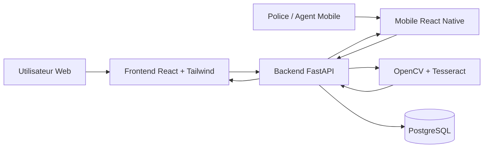

PROJET AUTOCHECK
Solution intelligente de vérification des véhicules et document
1. Contexte
Dans notre environnement actuel, l’achat de véhicules et l’utilisation de documents officiels présentent de nombreux risques majeurs, aussi bien pour les particuliers que pour les entreprises.
En effet, plusieurs problématiques persistent :
• La circulation de véhicules volés, clonés ou modifiés illégalement
• La falsification de documents (cartes grises, permis, certificats)
• L’absence de systèmes fiables pour vérifier l’authenticité des informations
• Le manque de transparence dans les transactions
• La difficulté d’accéder à des bases de données centralisées et sécurisées
Ces failles créent un environnement propice aux fraudes et aux abus.
Les conséquences sont importantes :
• Pertes financières considérables pour les acheteurs
• Risques juridiques liés à l’utilisation de biens ou documents frauduleux
• Difficultés pour les autorités à tracer et contrôler les infractions
• Frein au développement d’un marché formel et structuré
• Diminution de la confiance entre les acteurs (acheteurs, vendeurs, institutions)
Au-delà des pertes économiques, ces problèmes affectent directement la sécurité des citoyens et la crédibilité des systèmes administratifs.
Dans un monde de plus en plus digitalisé, l’absence d’un outil moderne, rapide et fiable de vérification constitue un véritable retard technologique et une opportunité d’innovation.
Il devient donc essentiel de mettre en place une solution capable de garantir :
la transparence, la sécurité et la confiance dans toutes les transactions liées aux véhicules et aux documents officiels.

2. Présentation du projet
AutoCheck est une plateforme numérique (desktop, web et mobile) qui permet de vérifier rapidement et automatiquement la fiabilité d’un véhicule ou d’un document.
L’objectif est simple :
 Donner à chaque utilisateur le pouvoir de vérifier avant de prendre une décision.
3. Problème à résoudre
Aujourd’hui, au niveau local :
•	Il n’existe pas de système centralisé de vérification
•	Les acheteurs ne peuvent pas confirmer les informations
•	Les fraudes sont fréquentes
•	Les données ne sont pas accessibles facilement
4. Solution AutoCheck
AutoCheck agit comme un outil de contrôle intelligent.
 Cas 1 : Vérification de véhicule
L’utilisateur entre :
•	Numéro VIN ou plaque
AutoCheck retourne :
•	Historique du véhicule
•	Statut (volé ou non)
•	Accidents
•	Propriétaires précédents
 Cas 2 : Vérification de documents
L’utilisateur :
•	Upload un document (permis, carte grise…)
AutoCheck :
•	Analyse le document
•	Détecte les falsifications
•	Confirme la validité
Intelligence intégrée
AutoCheck utilise :
•	Analyse automatique
•	Base de données
•	Intelligence artificielle
5. Pourquoi ce projet est important
AutoCheck permet de :
•	Réduire les fraudes
•	Sécuriser les transactions
•	Gagner du temps
•	Créer un climat de confiance
•	Moderniser le système local

6. Fonctionnement du système AutoCheck
Le fonctionnement d’AutoCheck repose sur l’interaction entre plusieurs acteurs clés, chacun ayant un rôle spécifique dans le système.
1. Police routière
La police routière utilise l’application mobile AutoCheck sur son téléphone pour effectuer des contrôles en temps réel.
Fonctionnement :
1.	L’agent scanne :
o	la plaque d’immatriculation (matricule)
o	ou la carte du chauffeur (QR code / numéro)
2.	Le système vérifie automatiquement dans la base de données
3.	Le résultat s’affiche immédiatement :
o	Véhicule en ordre
o	Véhicule signalé (volé, documents non valides, etc.)
Avantage : Contrôle rapide, fiable et sécurisé sur la route
 2. Agent du bureau (administration)
L’agent administratif est chargé d’enregistrer et de gérer les informations dans le système.
Fonctionnement :
1.	Enregistrement des véhicules :
o	Numéro VIN
o	Plaque
o	Informations du propriétaire
2.	Enregistrement des documents :
o	Carte grise
o	Permis de conduire
o	Certificats
3.	Mise à jour des données :
o	Changement de propriétaire
o	Signalement (vol, accident, etc.)
 Avantage : Base de données centralisée et fiable
 3. Propriétaire du véhicule
Le propriétaire peut accéder à AutoCheck via une application ou plateforme web.
Fonctionnement :
1.	Consulter les informations de son véhicule
2.	Vérifier l’état de ses documents
3.	Recevoir des alertes :
o	expiration des documents
o	signalement ou problème
 Avantage : Meilleur contrôle et transparence pour le propriétaire
🛠️ 4. Administrateur du système
L’administrateur gère l’ensemble de la plateforme.
Fonctionnement :
1.	Gestion des utilisateurs (police, agents, propriétaires)
2.	Sécurité du système
3.	Supervision des données
4.	Analyse et rapports
 Avantage : Système sécurisé, contrôlé et évolutif
7. Public cible
•	Particuliers
•	Vendeurs de véhicules
•	Entreprises
•	Assurances
•	Institutions

8. Vision du projet
Faire de AutoCheck la plateforme de référence en Afrique pour :
•	La vérification
•	La sécurité numérique
•	La lutte contre la fraude
10. Différenciateur clé
Contrairement aux solutions existantes :
•	Adapté au contexte local
•	Accessible ( desktop + mobile + web)
•	Rapide et simple
•	Évolutif avec IA
11. Roadmap (étapes)
•	Phase 1 : Prototype
•	Phase 2 : MVP (version simple)
•	Phase 3 : Tests utilisateurs
•	Phase 4 : Lancement
•	Phase 5 : Expansion
12. Conclusion
AutoCheck n’est pas seulement une application,
c’est une solution concrète à un problème réel.
C’est une opportunité de créer un impact fort dans la sécurité et la confiance numérique.

13. Stack technologique
- Frontend (Web) : React + Tailwind CSS
- Mobile : React Native (Expo)
- Backend : FastAPI (Python)
- Base de donnees : PostgreSQL
- Scan / OCR : OpenCV + Tesseract

14. Architecture technique
Structure du projet :
- Frontend/ : Application web React pour utilisateurs et administration
- Mobile/ : Application React Native pour controle terrain (police/agents)
- Backend/ : API FastAPI (metier, securite, OCR, verification)
- PostgreSQL : Stockage centralise des vehicules, documents, utilisateurs et historiques

15. Schema des interactions

16. Initialisation des projets
1. Frontend (React + Tailwind)
- Aller dans Frontend/
- Installer : npm install
- Lancer : npm run dev

2. Mobile (React Native avec Expo)
- Aller dans Mobile/
- Installer : npm install
- Lancer : npm run start

3. Backend (FastAPI)
- Aller dans Backend/
- Creer un environnement virtuel : python -m venv .venv
- Activer l'environnement : .venv\\Scripts\\activate
- Installer les dependances : pip install -r requirements.txt
- Copier .env.example vers .env puis ajuster DATABASE_URL et TESSERACT_CMD
- Lancer l'API : uvicorn app.main:app --reload --port 8000

